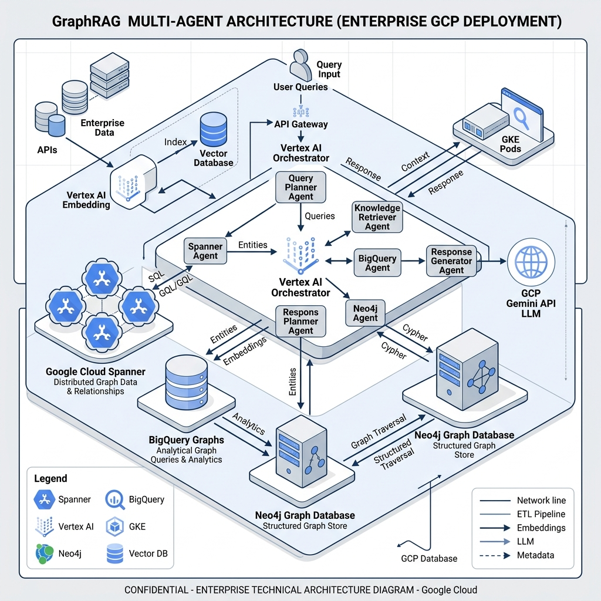

# 🤖 GraphRAG Multi-Agent Hub

A unified, multi-agent architecture that routes natural language (NL) queries to specialized backend graph databases to execute high-fidelity **GraphRAG** pipelines.



## 🚀 Overview

The **GraphRAG Multi-Agent Hub** is a production-grade demonstration of orchestrating specialized AI agents across diverse graph topologies. It employs a sophisticated **Two-Stage Retrieval** loop:

1.  **Stage 1: Semantic RAG (Discovery)** - Finding seed nodes via conceptual similarity.
2.  **Stage 2: Generative Graph Queries (Structure)** - Traversing multi-hop relationships for deep context.

### Key Features
- **Intelligent Routing:** A central Vertex AI Orchestrator routes requests based on domain intent.
- **Tabbed Agent Interface:** Real-time chat, interactive architecture explorer, and deep documentation.
- **Native DB Integration:** Leverage native vector search directly inside GQL, SQL, and Cypher.
- **Automated Verification:** Continuous coverage runs ensure all RAG paths are healthy.

## 🧠 GraphRAG Methodology

| retrieval stage | mechanism | technology | purpose |
| :--- | :--- | :--- | :--- |
| **Stage 1: Semantic** | Vector Embedding | Vertex AI `text-embedding-004` | Discovery of entry-point nodes. |
| **Stage 2: Structural** | Graph Traversal | GQL, SQL+Graph, Cypher | Topology discovery & context expansion. |

## 📊 Technical Pattern Matrix

| Domain | Database | Query Language | Vector Integration (Stage 1) |
| :--- | :--- | :--- | :--- |
| **E-Commerce** | **Cloud Spanner** | GQL (ISO standard) | `ML.DISTANCE` |
| **FSI & Risk** | **BigQuery** | SQL + Property Graph | `VECTOR_SEARCH` |
| **Marketing** | **Neo4j** | Cypher | Vector Index |

## 💻 Quick Start

### One-Liner Installation & Deployment
```bash
uv sync && cd frontend && npm install && npm run build && cd .. && ./deploy.sh
```

### Manual Setup
1. **Backend:** `uv sync`
2. **Frontend:** `cd frontend && npm install && npm run build`
3. **Run:** `python -m uvicorn server:app --reload --port 8080`

## 📂 Project Architecture

- `agent_orchestrator.py`: The brain. Multi-agent routing logic and query synthesis.
- `data_store.py`: Local development mock layer using NetworkX.
- `frontend/src/`: Modern React 18 frontend with Framer Motion animations.
- `deployment_scripts/`: Automated GCP provisioning scripts.

## ☁️ Deployment

Optimized for **Google Cloud Run**. The `deploy.sh` script handles automated provisioning, coverage verification, and containerized deployment.

## 📚 Product Documentation References

* [Spanner Graph Documentation](https://cloud.google.com/spanner/docs/graph)
* [BigQuery Property Graph Overview](https://cloud.google.com/bigquery/docs/property-graph-overview)
* [Neo4j Cypher Manual](https://neo4j.com/docs/cypher-manual/current/)
* [Vertex AI Documentation](https://cloud.google.com/vertex-ai/docs)
* [Using Spanner Graph with LangChain for GraphRAG](https://cloud.google.com/blog/products/databases/using-spanner-graph-with-langchain-for-graphrag)
